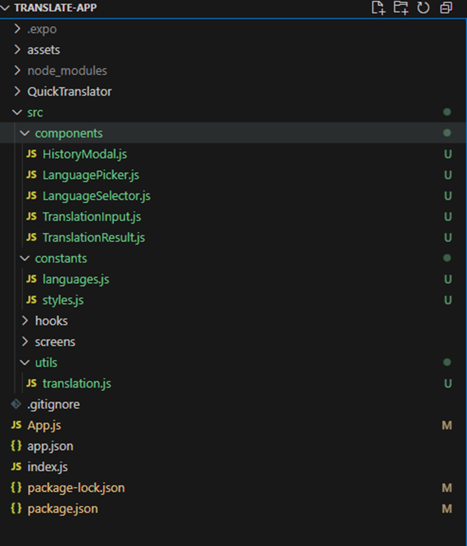

# Translate App Demo

## 1. Khởi tạo dự án

Tạo một dự án mới với Expo:
```sh
npx create-expo-app translate-app --template blank
```

## 2. Cài đặt dependencies

Cài đặt các thư viện cần thiết:
```sh
npm install @react-native-picker/picker expo-speech expo-clipboard
```

## 3. Cấu trúc dự án



## 4. Chạy ứng dụng
Tôi sẽ hướng dẫn bạn từng bước đầu tiên để bắt đầu xây dựng ứng dụng:
Bước 1: Cài đặt các dependencies cần thiết
```sh
expo install expo-speech expo-clipboard
```

Bước 2: Tạo cấu trúc thư mục cơ bản
```sh
mkdir src
mkdir src\components
mkdir src\constants
mkdir src\utils
```

Bước 3: Tạo file constants đầu tiên
1. Tạo file src/constants/languages.js
```sh
export const LANGUAGES = [
  { code: 'en', name: 'English' },
  { code: 'vi', name: 'Vietnamese' },
  { code: 'ja', name: 'Japanese' },
  { code: 'ko', name: 'Korean' },
  { code: 'zh', name: 'Chinese' },
  // Thêm các ngôn ngữ khác tùy nhu cầu
];
```
2. Tạo file src/constants/styles.js
```sh
import { StyleSheet } from 'react-native';

export const styles = StyleSheet.create({
  container: {
    flex: 1,
    backgroundColor: '#f8f8f8',
  },
  header: {
    flexDirection: 'row',
    justifyContent: 'space-between',
    alignItems: 'center',
    padding: 16,
  },
  headerTitle: {
    fontSize: 20,
    fontWeight: 'bold',
    color: '#4B0082',
  },
  // Thêm các styles cơ bản khác
});
```
3. Tạo file App.js cơ bản đầu tiên
```sh
import React, { useState } from 'react';
import { SafeAreaView, StatusBar, View, Text } from 'react-native';
import { styles } from './src/constants/styles';

export default function App() {
  // Khởi tạo các state cơ bản
  const [text, setText] = useState("");
  const [translatedText, setTranslatedText] = useState("");
  const [sourceLang, setSourceLang] = useState("en");
  const [targetLang, setTargetLang] = useState("vi");

  return (
    <SafeAreaView style={styles.container}>
      <StatusBar backgroundColor="#f8f8f8" barStyle="dark-content" />
      
      {/* Header */}
      <View style={styles.header}>
        <Text style={styles.headerTitle}>Quick Translator</Text>
      </View>
      
      {/* Các component khác sẽ được thêm sau */}
    </SafeAreaView>
  );
}
```

Bước 4: Tạo component đầu tiên - TranslationInput
Tạo file src/components/TranslationInput.js
```sh
import React from 'react';
import { View, TextInput, TouchableOpacity, Text, StyleSheet } from 'react-native';

export const TranslationInput = ({ text, setText, clearText }) => {
  return (
    <View style={styles.container}>
      <TextInput
        style={styles.input}
        multiline
        placeholder="Nhập văn bản cần dịch..."
        value={text}
        onChangeText={setText}
      />
      {text.length > 0 && (
        <TouchableOpacity style={styles.clearButton} onPress={clearText}>
          <Text style={styles.clearButtonText}>×</Text>
        </TouchableOpacity>
      )}
    </View>
  );
};

const styles = StyleSheet.create({
  container: {
    margin: 16,
    position: 'relative',
  },
  input: {
    borderWidth: 1,
    borderColor: '#ddd',
    borderRadius: 8,
    padding: 12,
    minHeight: 100,
    backgroundColor: '#fff',
    fontSize: 16,
  },
  clearButton: {
    position: 'absolute',
    right: 8,
    top: 8,
    padding: 4,
  },
  clearButtonText: {
    fontSize: 20,
    color: '#666',
  },
});
```

Bước 5: Tạo LanguageSelector Component
Tạo file src/components/LanguageSelector.js:
```sh
import React from 'react';
import { View, TouchableOpacity, Text, StyleSheet } from 'react-native';
import { LANGUAGES } from '../constants/languages';

export const LanguageSelector = ({
  sourceLang,
  targetLang,
  autoDetect,
  onSourcePress,
  onTargetPress,
  onSwapPress,
}) => {
  const getLanguageName = (code) => {
    return LANGUAGES.find(lang => lang.code === code)?.name || code;
  };

  return (
    <View style={styles.container}>
      <TouchableOpacity style={styles.langButton} onPress={onSourcePress}>
        <Text style={styles.langText}>
          {autoDetect ? "Tự động phát hiện" : getLanguageName(sourceLang)}
        </Text>
      </TouchableOpacity>

      <TouchableOpacity style={styles.swapButton} onPress={onSwapPress}>
        <Text style={styles.swapButtonText}>⇄</Text>
      </TouchableOpacity>

      <TouchableOpacity style={styles.langButton} onPress={onTargetPress}>
        <Text style={styles.langText}>{getLanguageName(targetLang)}</Text>
      </TouchableOpacity>
    </View>
  );
};

const styles = StyleSheet.create({
  container: {
    flexDirection: 'row',
    alignItems: 'center',
    justifyContent: 'center',
    padding: 16,
  },
  langButton: {
    padding: 10,
    borderRadius: 8,
    backgroundColor: '#fff',
    borderWidth: 1,
    borderColor: '#ddd',
    minWidth: 120,
    alignItems: 'center',
  },
  langText: {
    fontSize: 16,
    color: '#4B0082',
  },
  swapButton: {
    padding: 10,
    marginHorizontal: 10,
  },
  swapButtonText: {
    fontSize: 24,
    color: '#4B0082',
  },
});
```

Bước 8: Tạo Translation Utils
Tạo file src/utils/translation.js:
```sh
// Đây là ví dụ sử dụng Google Translate API
// Bạn cần thay thế bằng API key của riêng mình
export const translateText = async (text, sourceLang, targetLang) => {
  try {
    const response = await fetch(
      `https://translation-api-endpoint.com/translate`, {
        method: 'POST',
        headers: {
          'Content-Type': 'application/json',
          'Authorization': 'Bearer YOUR_API_KEY'
        },
        body: JSON.stringify({
          text,
          source: sourceLang,
          target: targetLang
        })
      }
    );
    
    const data = await response.json();
    return data.translatedText;
  } catch (error) {
    console.error('Translation error:', error);
    throw error;
  }
};

export const detectLanguage = async (text) => {
  try {
    const response = await fetch(
      `https://translation-api-endpoint.com/detect`, {
        method: 'POST',
        headers: {
          'Content-Type': 'application/json',
          'Authorization': 'Bearer YOUR_API_KEY'
        },
        body: JSON.stringify({ text })
      }
    );
    
    const data = await response.json();
    return data.detectedLanguage;
  } catch (error) {
    console.error('Language detection error:', error);
    throw error;
  }
};
```
Bước 9: Tạo TranslationResult Component
Tạo file src/components/TranslationResult.js:
```sh
import React from 'react';
import { View, Text, TouchableOpacity, StyleSheet } from 'react-native';

export const TranslationResult = ({
  translatedText,
  onSpeak,
  onCopy,
  onFavorite,
  isFavorite
}) => {
  return (
    <View style={styles.container}>
      <Text style={styles.resultText}>{translatedText}</Text>
      
      <View style={styles.actions}>
        <TouchableOpacity style={styles.actionButton} onPress={onSpeak}>
          <Text style={styles.actionButtonText}>🔊</Text>
        </TouchableOpacity>
        
        <TouchableOpacity style={styles.actionButton} onPress={onCopy}>
          <Text style={styles.actionButtonText}>📋</Text>
        </TouchableOpacity>
        
        <TouchableOpacity style={styles.actionButton} onPress={onFavorite}>
          <Text style={styles.actionButtonText}>
            {isFavorite ? '⭐' : '☆'}
          </Text>
        </TouchableOpacity>
      </View>
    </View>
  );
};

const styles = StyleSheet.create({
  container: {
    margin: 16,
    padding: 16,
    backgroundColor: '#fff',
    borderRadius: 8,
    borderWidth: 1,
    borderColor: '#ddd',
  },
  resultText: {
    fontSize: 16,
    lineHeight: 24,
    color: '#333',
  },
  actions: {
    flexDirection: 'row',
    justifyContent: 'flex-end',
    marginTop: 16,
  },
  actionButton: {
    padding: 8,
    marginLeft: 16,
  },
  actionButtonText: {
    fontSize: 20,
  },
});
```
Bước 10: Cập nhật App.js để tích hợp các components mới
Cập nhật file App.js để thêm các components mới:
```sh
import React, { useState } from 'react';
import { SafeAreaView, StatusBar, View, Text } from 'react-native';
import { styles } from './src/constants/style';
import { LanguageSelector } from './src/components/LanguageSelector';
import { TranslationInput } from './src/components/TranslationInput';
import { TranslationResult } from './src/components/TranslationResult';

export default function App() {
  // Khởi tạo state
  const [text, setText] = useState("");
  const [translatedText, setTranslatedText] = useState("");
  const [sourceLang, setSourceLang] = useState("en");
  const [targetLang, setTargetLang] = useState("vi");
  const [autoDetect, setAutoDetect] = useState(false);
  const [isLoading, setIsLoading] = useState(false);
  const [error, setError] = useState(null);

  const swapLanguages = () => {
    setSourceLang(targetLang);
    setTargetLang(sourceLang);
  };

  const speakTranslation = () => {
    // TODO: Thêm logic text-to-speech
  };

  const copyToClipboard = () => {
    // TODO: Thêm logic copy văn bản
  };

  const translateText = async (text, sourceLang, targetLang) => {
    // TODO: Gọi API dịch
    return `Bản dịch của: ${text}`;
  };

  const handleDetectLanguage = async () => {
    // TODO: Tự động nhận diện ngôn ngữ
  };

  const handleTranslate = async () => {
    if (!text.trim()) return;

    setIsLoading(true);
    try {
      if (autoDetect) {
        await handleDetectLanguage();
      }

      const result = await translateText(text, sourceLang, targetLang);
      setTranslatedText(result);
    } catch (error) {
      setError("Translation failed");
    } finally {
      setIsLoading(false);
    }
  };

  return (
    <SafeAreaView style={styles.container}>
      <StatusBar backgroundColor="#f8f8f8" barStyle="dark-content" />

      {/* Header */}
      <View style={styles.header}>
        <Text style={styles.headerTitle}>Quick Translator</Text>
      </View>

      <LanguageSelector
        sourceLang={sourceLang}
        targetLang={targetLang}
        autoDetect={autoDetect}
        onSourcePress={() => {/* TODO */}}
        onTargetPress={() => {/* TODO */}}
        onSwapPress={swapLanguages}
      />

      <TranslationInput
        text={text}
        setText={setText}
        clearText={() => setText("")}
      />

      {translatedText && (
        <TranslationResult
          translatedText={translatedText}
          onSpeak={speakTranslation}
          onCopy={copyToClipboard}
          onFavorite={() => {/* TODO */}}
          isFavorite={false}
        />
      )}
    </SafeAreaView>
  );
}
```

## 5. Chạy ứng dụng

Khởi chạy ứng dụng trên thiết bị hoặc trình giả lập:
```sh
npx expo start
```

## 6. Chức năng chính

- Chọn ngôn ngữ dịch với `@react-native-picker/picker`
- Đọc văn bản bằng `expo-speech`
- Sao chép văn bản dịch bằng `expo-clipboard`

## 7. Liên hệ
Nếu có bất kỳ vấn đề nào, vui lòng tạo issue trên GitHub hoặc liên hệ với nhóm phát triển.

